# EarthCare

Sistema inteligente de monitoreo de plantas desarrollado en Kotlin para Android.

EarthCare permite monitorear variables ambientales en tiempo real mediante sensores IoT conectados a Firebase, proporcionando alertas inteligentes, visualización histórica de datos y asistencia conversacional mediante PlantGPT.

---

## Tecnologías utilizadas

- Kotlin
- Android Studio
- Firebase Authentication
- Firebase Realtime Database
- ESP32
- MPAndroidChart
- PlantGPT
- IoT

---

## Características principales

### Monitoreo en tiempo real

- Temperatura
- Humedad exterior
- Humedad del suelo
- Luz

### Gestión de plantas

- Registro de plantas
- Configuración personalizada
- Parámetros ideales por especie

### Alertas inteligentes

- Exceso de luz
- Falta de luz
- Temperatura alta
- Temperatura baja
- Humedad fuera de rango

### Visualización histórica

- Gráficas de temperatura
- Gráficas de humedad
- Gráficas de luz

### PlantGPT

Asistente conversacional para responder preguntas relacionadas con el cuidado de plantas.

---

## Arquitectura

ESP32
↓
Sensores IoT
↓
Firebase Realtime Database
↓
Aplicación Android
↓
Visualización y alertas

---

## Capturas

### Inicio de sesión

### Dashboard principal

### Alertas inteligentes

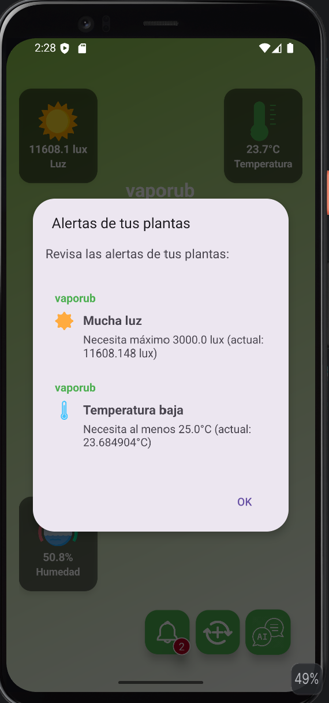

### PlantGPT

### Gráfica de luz

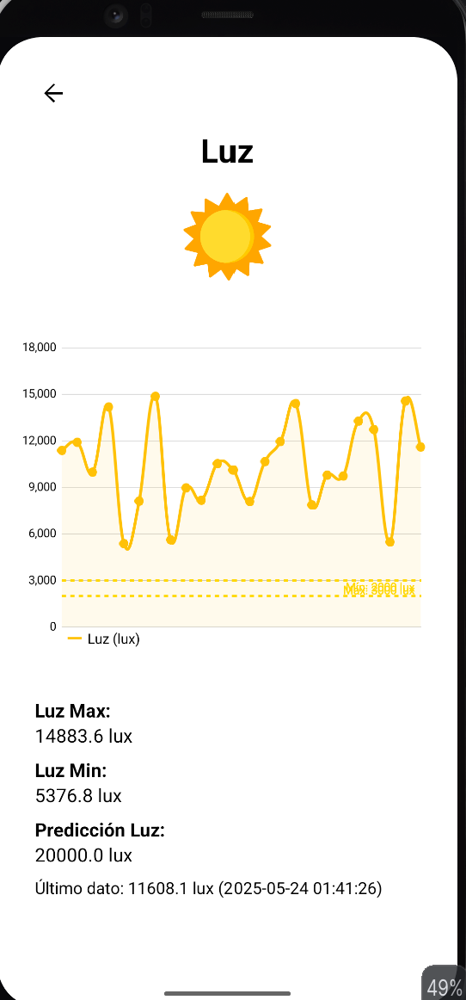

### Gráfica de temperatura

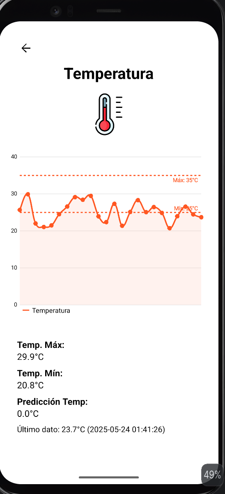

### Gráfica de humedad

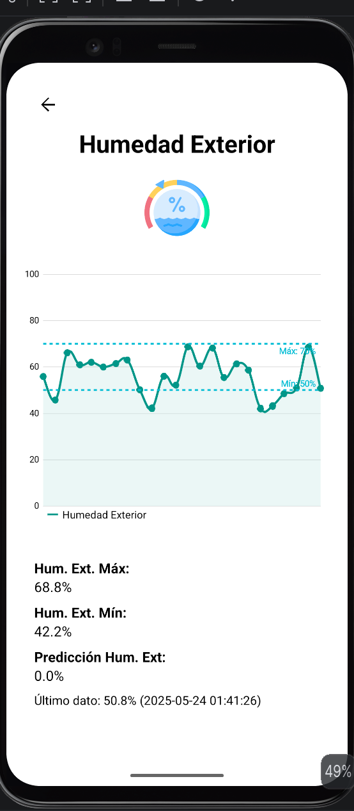

---

## Firebase

### Authentication

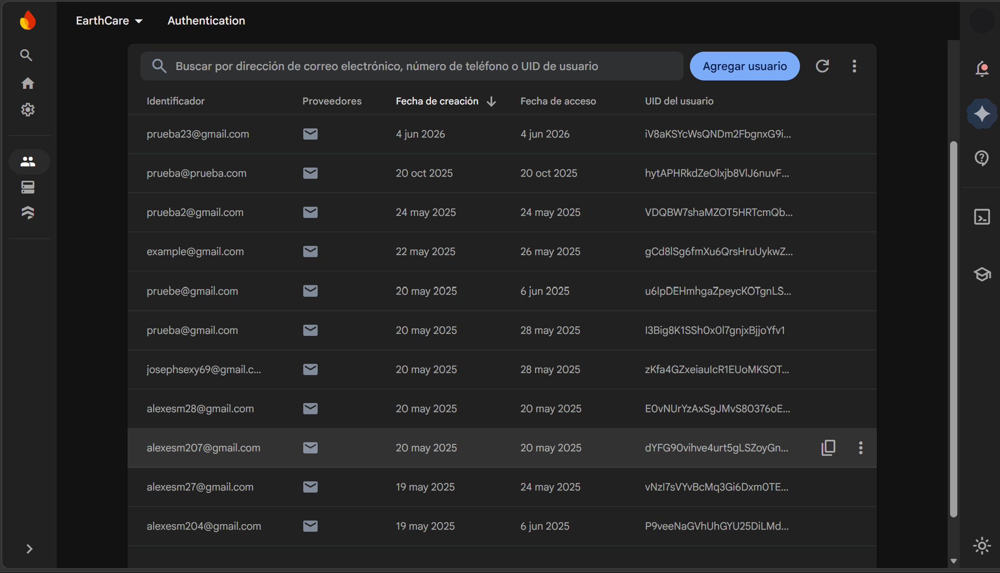

### Realtime Database

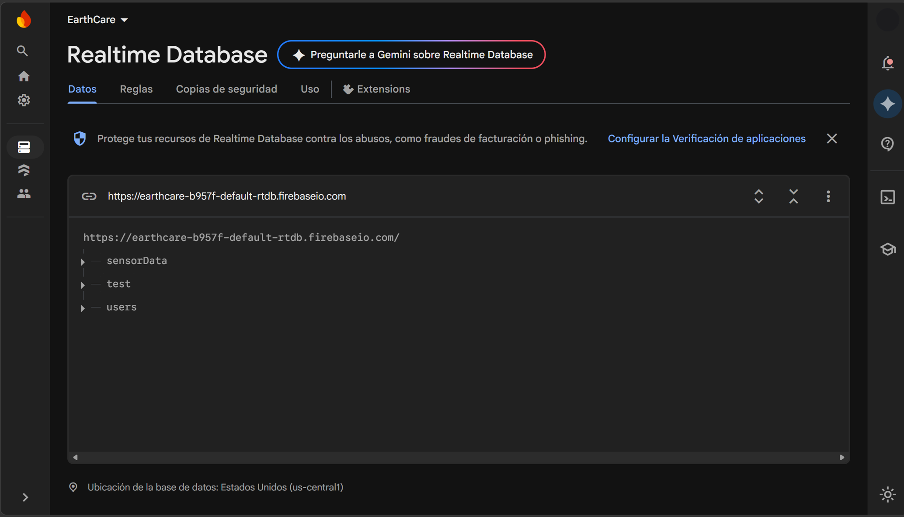
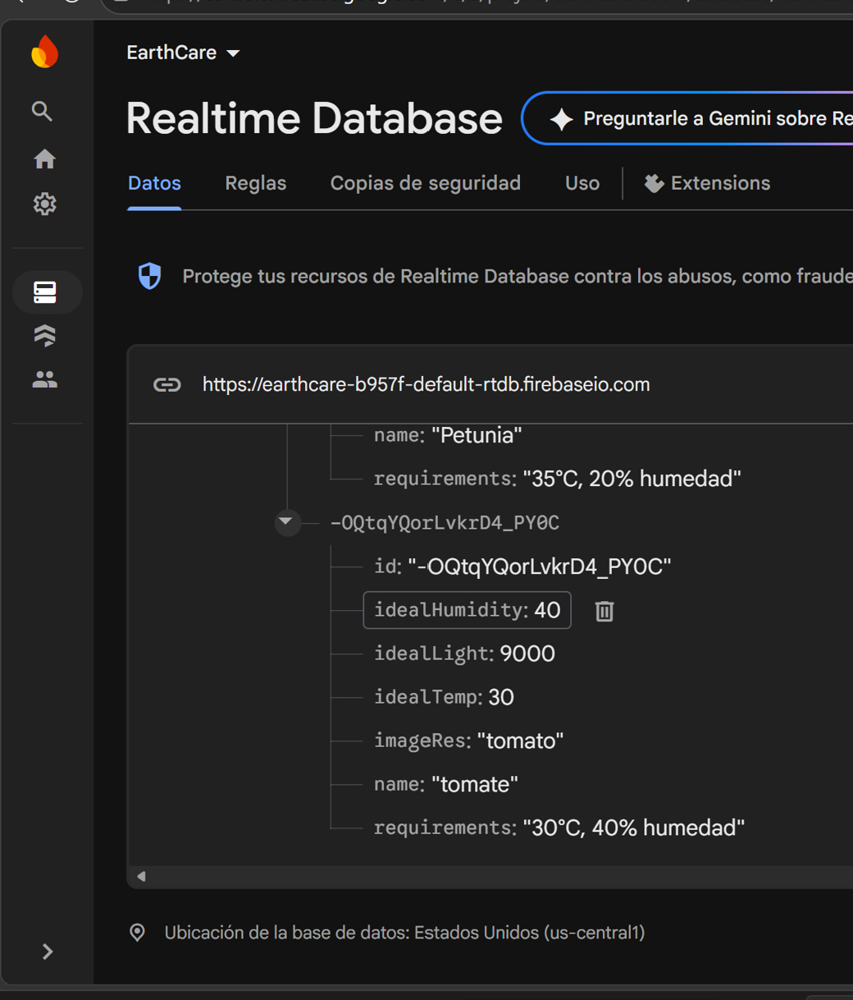
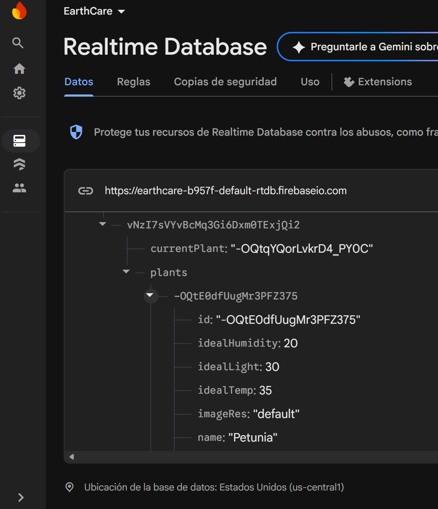
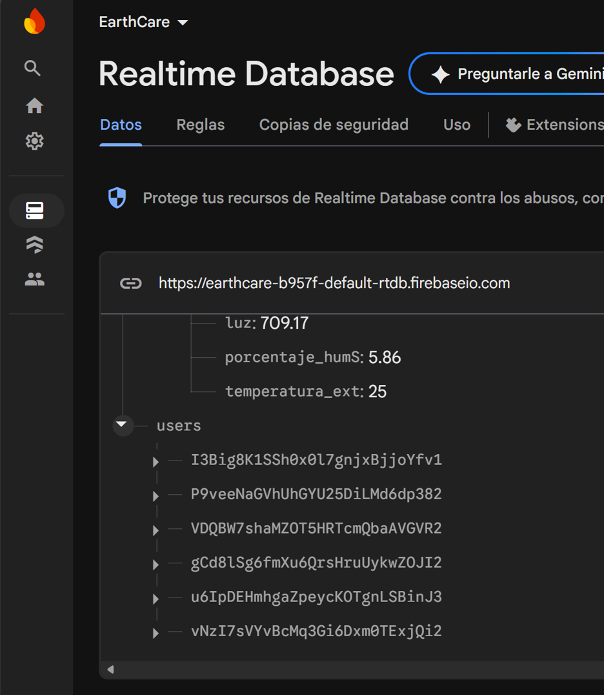
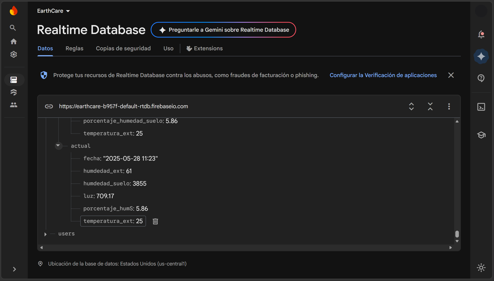
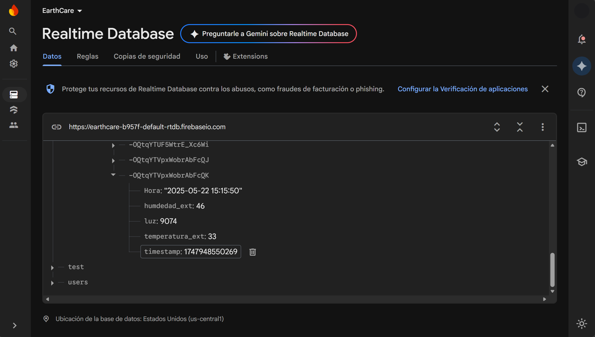

---

## Hardware

### Prototipo físico

---

## Autor

Francisco Javier Cordoba Tufiño

Ingeniería en Software
Universidad Autónoma de Querétaro
